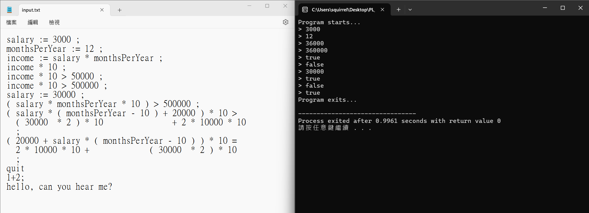

# Interpreter Project

本專案是一個簡易的解釋器，它能夠解析並執行定義好的命令和表達式。

## 功能特點

- 支援基本算術表達式的解析和計算。
- 支援布林表達式的解析和計算。
- 支援變數賦值和使用。
- 支援註解。
- 支援互動式輸入和檔案輸入。

## 開發環境

- 開發語言：C/C++
- 建議編輯器：Visual Studio Code, CLion, 或任何支援C/C++的編輯器
- 編譯環境：GCC/G++, 支援C++11或以上標準

## 開發過程以及檔案結構

### 編譯器開發過程

#### 詞法分析（Lexer）
我首先設計並實現了詞法分析器，這部分負責將原始程式碼轉換為一個個 `token`。每個 `token` 代表程式語言中的一個基本單位（如數字、運算符、關鍵字）。為了將這個大功能拆解為小部分，我將詞法分析的功能拆分為不同的模組，分別處理不同類型的 `token` 識別，例如數字、變數名、運算符等。

- **Tokenizer.h**：負責正則表達式匹配與字符流的處理，將原始程式碼拆解為一系列的 `token`。
- **主程式**：將 `token` 組成結構體以便後續解析，並記錄當前 `token` 的位置，支持錯誤處理。

#### 語法分析（Parser）
在進行語法分析時，我設計了語法樹來表示程式的語法結構。語法分析負責確定 `token` 組成的結構是否符合語言的語法規則。我將語法分析器分為若干個模組，每個模組處理特定的語法結構（如算術表達式、布林表達式、變數賦值等）。這樣不僅能夠提高模組化程度，也使得程式更易於維護和擴展。

- **Parser.h**：負責將 `token` 串接成語法樹，並檢查語法是否正確。這一部分的重點是處理括號、優先級運算符等語法規則。

#### 語義分析與執行（Semantic Analysis and Execution）
語法分析後，我進行了語義分析，檢查程式中是否存在語法以外的邏輯錯誤（如變數未賦值即使用）。在此過程中，我將變數的賦值和使用管理模組化，將變數的狀態存儲於一個符號表中。

- 進行了錯誤檢查並處理變數作用域、類型檢查等問題。
- 設計了一個簡單的執行引擎來運行解析後的語法樹，並實現了基本的數字運算和布林邏輯。

#### 如何將大程式分解為小部分
在此專案中，我將大範圍的程式邏輯拆解為許多功能模組，每個模組專注於特定的任務。這樣的做法不僅提高了代碼的可讀性，也使得除錯過程更為高效。各模組的獨立性使得後期維護和擴展（如加入更多運算符支持或錯誤處理機制）變得更加簡便。

#### 架構分析

- **分層架構**：整個解釋器的設計基於層次化的架構，將詞法分析、語法分析和語義分析等步驟分開，使每個層次的處理邏輯清晰且互不干擾。
- **模組化設計**：通過將解釋器的各部分功能分解為多個可重用的模組（如 `Tokenizer`、`Parser`、`Executor`），每個模組負責具體的任務，確保代碼的高內聚低耦合，並且方便進行單元測試。

## 檔案結構

- `main.cpp`：主程式入口，負責讀取輸入和初始化解釋器。
- `Tokenizer.h`：負責將輸入文本分割成 `token`。
- `Parser.h`：根據 `token` 進行語法分析並執行相應的命令。

## 使用方法

### 編譯專案

在專案目錄下執行以下命令來編譯專案：

```bash
g++ -std=c++11 -o interpreter main.cpp
```

## 範例

   
